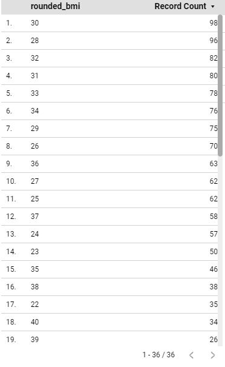
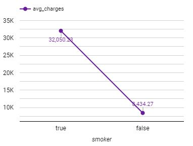
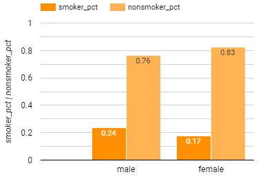

# Introduction
This is a personal project. The main goal of this project was to sharpen my skills with Looker Studio visualizations, Google BigQuery, and Machine Learning. In this project, I created visualizations of the dataset using Looker Studio to gather insights. I used Google BigQuery to store my dataset and make queries to gather further insights and create features to be used in my visualizations. Lastly, I used PyCaret to create an effective machine learning model to predict medical insurance charges given age, sex, U.S. region, children, BMI, and whether or not the person is a smoker.

To refine my skills, I included the following things in the personal project:
- Database usage/data storage
- SQL Querying
- Data visualizations
- Data preparation/cleaning (removal of outliers, standardization, feature encoding)
- Feature engineering
- Data analysis
- Model creation, evaluation, and visualization
- Model tuning/optimization
- Metrics evaluation and visualizations
- Model finalization

The technologies and libraries used for this project are:
- BigQuery
- Looker Studio
- Python 3.11.7
- Pandas 2.2.0
- NumPy 1.26.3
- Matplotlib
- Scikit-learn 1.4.0
- PyCaret 3.2.0

# Kaggle Dataset
- The first step I took was to find a public dataset to work with. I found a [Kaggle Medical Insurance Dataset](https://www.kaggle.com/datasets/mirichoi0218/insurance?resource=download) which has 1338 entries, 6 features, and one target variable.

- These features are age (age of primary beneficiary), sex, region (in the U.S.), smoker, children (number of children covered by health insurance/number of dependents), and BMI.

- The target variable is charges (the individual medical costs billed by the health insurance company).

# BigQuery
- I loaded this dataset into a data warehouse on the Google Cloud Platform and viewed it in BigQuery.

- I created 3 additional columns that served as encoded versions of the categorical columns of the dataset (sex and region - string columns, smoker - bool column). 

- For these encoded features:

  - False is 0, True is 1

  - Female is 0, Male is 1

  - Regions are northeast - 0, northwest - 1 southeast - 2, southwest - 3

# Looker Studio Data Analysis & Visualization
- I then made visualizations of these features using Looker Studio. I looked at the distributions of the columns, the correlations of the features to the target variable, and the correlations between features.

- I also created a couple of fields to look deeper into some of the features and correlations. These fields are avg_charges, rounded_bmi, avg_bmi, smoker_pct, nonsmoker_pct, male_pct, and female_pct. There are percentage values that help me to look deeper into the distribution of males, females, and smokers in the different regions, ages, BMIs, and so on. This makes things clearer than using counts. There are also the rounded BMI (rounded down to 1s place) and average BMI and charges fields which help get a better look at the dataset and general trends as a whole.

## Here are my findings:

### Feature Counts

- Sex and region had mostly balanced proportions.

- Record counts of the number of children steadily decreased when going from 0 children to 5. There was an especially large drop from 3 children to 4 (11.7% to 1.9%). Those with 5 children only make up 1.3% of the dataset.

- The distribution for age is mostly balanced except for a large amount of 18 and 19-year-olds skewing the distribution to the right.

- Most of the customers weren't smokers with there being an 80/20 percent split.

- There are a lot of varying BMIs covered in the dataset with most of them being between 22 and 40. There are quite a few outliers, some people being as low as 16 while on the other end, there are even more with around 26 people being between 44 and 53. This is an interesting find as this shows a small trend of there being a lot more individuals being outliers on the higher end than the lower end (likely due to the obesity issues in America).

### Feature to Target Correlations

- When comparing age to the target variable, I'm not certain but there appear to be 3 mostly linear lines that show an increase of charges with advancing age. This could represent a possible positive correlation between age and charges and an additional factor at play that separates the insured customers into 3 groups.

- The average insurance charge of smokers is almost 4 times that of non-smokers. This is a predictable yet important find (32k vs 8.4k).

- I looked for outliers in the charges of smokers and non-smokers but was unable to find any. The charges of non-smokers range from 4.7k to 37k while the charges of smokers range from 12.8k to 62.5k, a rather large gap. This could be the cause of some of the interesting and strange behavior seen when looking at the average charges of some features.

- The average insurance charge of males is about $1500 higher than that of females (14k vs 12.5k). This could be caused by another factor rather than simply based on sex. For example, perhaps males are more likely to smoke and smoking is known to cause higher health insurance costs.

- When comparing the average insurance charges by region, it goes from $14,700 to $12,350, with northwest and southwest being fairly close at ~$12,400 while southeast is the highest with about a $1300 gap between it and northeast. This could suggest that the East is more expensive insurance-wise than the West or that one of the other factors plays a role in this increase in price.

- To look further into the previous finding, I looked at the charges seen for each region and noticed some outliers for three of the regions that are skewing the average charges to be higher for those regions. There were no outliers on the low side, only on the high side. Northeast has one outlier (10k above the 2nd highest charge), northwest has two outliers (one 8k higher and another 13k above the normal charges), and southeast has two outliers (both ~13k higher than normal charges). This mostly aligns with the previous finding except that the average charges of northwest and southwest were almost the same yet northwest had two outliers while southwest had none. I'll need to look at this data further after removing the outliers.

- When looking at the average charges for different BMIs, there appears to be a general trend of higher costs for higher BMIs with a strange outlier at the BMIs 49 and 50, where the costs dipped down 7k and then 9k all the way down to 2.4k average costs at BMI 50. This seems rather strange but I have an idea as to what could have caused this. I believe that these BMIs at the higher end are rather rare, meaning they can heavily sway the average charges of the charts and that their charges can largely vary. It's possible these outliers are some sort of bodybuilders, who tend to have large BMIs but are quite physically healthy, likely resulting in lower insurance charges. This is just speculation but I find it difficult to make sense of these outliers otherwise.

- When looking at the average charges for the number of children, charges sharply increase from 1 to 2 children (12.7k vs 15k), stay about the same for 3 children (15k vs 15.3k), slightly decrease at 4 children (15.3k vs 13.85k), and then very sharply drop off at 5 children (13.85k vs 8.8k). This is rather interesting as I had assumed insurance costs would rise as the number of dependents rose. This only seemed to be true up until 4 children, where charges instead began dipping down sharply. Further investigation will likely be needed.

- I looked for outliers in the number of children. There were a few but not enough to have affected the trend of the average charges chart to a large extent. It seems the charges of those with 0-3 children are rather similar with those at 4 and 5 children are quite low.

### Feature to Feature Correlations

- When looking at age vs average children count, as one would expect, an upside-down parabola pattern appears. At 20, the average children count is 0.5, which steadily rises until age 40 where the average children count is ~1.5, which then steadily decreases as age reaches the 60s where the average children count is back down to 0.5.

- When looking at average BMI against age, there seems to be a general trend of increasing BMI with increasing age.

- When looking at the average number of children for each region, northeast and southeast are 1.05 while northwest and southwest are ~1.15. This lines up with the earlier finding that charges seemed to be higher in the eastern regions than the western ones. Higher insurance costs likely result in couples having fewer children.

- When looking at the distribution of smokers in the different sexes, it seems that males are more often to smoke than females. 24% of males smoke vs 17% of females.

- I looked for a trend in the percentage of smokers at different ages. There is no visible trend so it's hard to say that age plays much of a role in how many people smoke.

- When looking at the percentage of smokers across regions, we see some interesting numbers. The percentage of smokers in the northwest and the southwest is 18% while it is 25% for the southeast and 21% for the northeast regions. Perhaps this contributes to an earlier finding that insurance costs in the eastern regions are higher than western ones.

- Interestingly, the smoker percentage of varying numbers of children (number of dependents) follows the same trend as the average insurance charges of varying numbers of children. The smoker percentage slowly rises until 4 and 5 children where it sharply decreases. This could be the reason for decreasing average costs for a higher number of dependents. People with 4 or 5 children are less likely to smoke. I'm not certain whether this is just cause 4 and 5 children cases are rarer and therefore can more easily skew the numbers in this dataset or if this is an actual trend seen across the United States. For now, I can only assume that the former is the case as we had discussed earlier that those with 4 children and 5 children only make up 1.9% and 1.3% of the dataset respectively. Meanwhile, those with 3 children make up 11.7% which is much higher. Those with 4 and 5 children can be considered to be outliers and it is therefore hard to ascertain correlations or trends with the data of those people.

- There is no discernible trend when comparing the percentage of smokers with BMIs, though one of the questions from before again pops up as those with 49 and 50 BMIs have a smoker percentage of 0, possibly confirming my earlier speculation that these people are some sort of bodybuilders or healthy muscular people.

- When looking at the percentage of males across different BMIs, we see no discernible trend and the line stays around 50% which indicates an equal number of males and females. There are some outliers on the lower and upper ends of BMI but those are a result of the small dataset and the rarity of such BMIs. Though, it is somewhat interesting that both the highest and lowest end outliers are made up of only men.

- When looking at the percentage of males in each of the regions, we see that they are mostly the same at around ~50%, with the southeast being the only one slightly different at 52%.

# Data Preparation
Now, it's time to put the data into Jupyter Notebook for cleaning before it is used in training a model. Here was my process:
- Check dtypes of features to see which needed to be encoded
- Check for null values (none present)
- Look at histograms of continous features to look for any obvious outliers (noticed a few in the bmi and charges variables)
- Use z-scores to identify outliers (those with a z-score greater than 3) and drop outliers from dataset
- Look at histograms again to see the improvement
- Make transformations on categorical features to create encoded versions
- Save CSVs of cleaned dataframes
Here are the histograms before and after the removal of outliers for BMI and charges:

BMI:

Charges:

# Model Creation
Finally, it's time to begin model creation. I used PyCaret's RegressionExperiment object for this. I separated the dataset's column into those to be ignored, those that are numerical, and those that are categorical. The original categorical columns (the non-encoded ones) were ignored, age and bmi were set to numerical, and the encoded features along with the children column were set to categorical variables. I scaled the numerical features with Sklearn's StandardScaler and save the scaler as a pkl file. I created a RegressionExperiment object and set it up to have an 80/20 train/test split, allowed fold shuffling, and set a fold size of 5. When comparing models, Gradient Boosting Regressor appeared to fit to the data the best with an R-Squared score of 0.85 and had the best RMSE score. Hence, I chose this model type for my dataset. I attempted to tune the model on the RMSE metric but the tuning didn't result in any improvements. 
I evaluated the model using PyCaret's visualizations:

As you can see, it appears the model is fitting very well to the data, but there appears to be some entries that are outside of the general pattern of the dataset. Also, it appears that the only features that held importance in determining insurance charges was whether someone was a smoker or not, their age, and their BMI. Smoker_encoded was specifically important as it had a feature important of 0.7 while bmi and age were only around 0.17 and 0.12. The other features held little to no importance in determining the target. I then made the model make predictions on the holdout set to see whether it generalized enough and didn't overfit. The model achieved an RMSE of ~4800 on the holdout set and therefore generalizes quite well. Satisfied, I finalized the model by training it on the entire dataset and saved it. You can download and view those files yourself. Feel free to repeat my experiment or see how the model generalizes to unseen data of other datasets.

# Conclusion
In conclusion, I was able to create a Gradient Boosting Regressor model that could predict medical insurance charges based on age, bmi, and whether you were a smoker or not. The model achieved 4800 RMSE on the holdout set and had a R-Squared score of around 0.81. 
